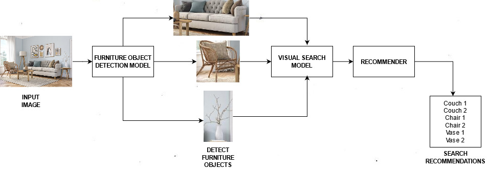

# Furniture Vision API 
## _Furniture Object Detector and Recommender_

This repository contains all the code to build a Furniture Vision Search API that can detect furniture objects in an image and then recommend similar products.  
## Business Value of the Project
The custom visual search engine can be embedded on furniture e-commerce platforms and can improve user experience, by providing better onsite recommendations.
## Project Overview

## Features

- Input image file or url.
- Furniture-in-room detection.
- Performs visual search. 
- Returns nearest matches.
- Populates gallery with search recommendations.

## Tech

This API is primarily written in [Python](https://www.python.org/) . It makes use of a number of other APIs and services :

- [Flask](https://flask.palletsprojects.com/en/2.0.x/) - Python based micro web framework to create web applications.
- [Azure Computer Vision API](https://azure.microsoft.com/en-in/services/cognitive-services/computer-vision/) - Provisions detection of furniture objects in the image.
- [Clarifai API](https://www.clarifai.com/) - Provisions visual search of detected furniture objects.
- [Cloudinary API](https://cloudinary.com/home-6-4-video-b?utm_source=google&utm_medium=cpc&utm_campaign=Rbrand&utm_content=482515151017&utm_term=cloudinary%20api&gclid=CjwKCAjwt8uGBhBAEiwAayu_9XdLoapp03-YgFBuKkQrXC2vSiAh8Aa3nbWVBW1ZwgNrqzp-hmfiGhoCVigQAvD_BwE) - Stores the blob data and generates unique url for each entry. 
- [MongoDB Atlas](https://www.mongodb.com/cloud/atlas) - NoSQL database for storing annotations of images.
- [Heroku](https://www.heroku.com/) - Platform for deployment.

## Repository Contents
- app.py- The main Flask application.
- handlers.py-Object Detection using Microsoft Azure API.
- train.py- Populates the Clarifai portal with the image dataset.
- search.py- Visual Search through the Clarifai API.
- functions.py- Provisions API calls and MongDB Atlas connections.